# 🙆‍♀️ 칭구칭구 Backend


---

## 🌐 Links

| 항목 | 링크 |
|------|------|
| 🖥️ **실서버 (Production)** | [https://chinguchingu.vercel.app](https://chinguchingu.vercel.app) |
| 🎨 **프론트엔드 레포지토리** | [chinguchingu-frontend](https://github.com/DdNnTt/Chingu-Frontend) |
| 📘 **API 문서 (Swagger)** | [https://chinguchingu.kro.kr/swagger-ui/index.html](https://chinguchingu.kro.kr/swagger-ui/index.html) |
| 📄 **API 명세서 (Notion)** | [API 상세 문서 보기](https://www.notion.so/API-ee338c350e3e42acac3cb8711f65ac9d?source=copy_link) |
| 🖼️ **와이어프레임 (Figma)** | [Figma Prototype 보기](https://www.figma.com/design/bgs192Cul5gWjxLqJFGhV7/%EC%B9%AD%EA%B5%AC%EC%B9%AD%EA%B5%AC---%EC%99%80%EC%9D%B4%EC%96%B4%ED%94%84%EB%A0%88%EC%9E%84?node-id=0-1&t=5Pk8TXvuT012jLpd-1) |

---

## 💡 프로젝트 소개

> **우리만의 공간, 진짜 친구들과의 기록과 추억을 나누다**

이 프로젝트는 로그인한 사용자만 이용 가능한 모바일 기반의 **소셜 플랫폼**으로  
친구들과의 **진짜 소통과 관계 형성**을 중심에 두고 있습니다.  
**마이홈**을 중심으로 친구의 홈을 방문하고, 친구를 맺어  
1:1 채팅은 물론, 그룹을 만들어 추억을 남길 수 있습니다.

---


## ⚙️ 사용 스택 (Tech Stack)

### 💻 **Frontend**


### ⚙️ **Backend**


### 🗄️ **Database**


### ☁️ **Infrastructure / DevOps**


---

## 🧩 주요 기능 (Key Features)

| 기능 | 설명                                                                         |
|------|----------------------------------------------------------------------------|
| 👤 **회원 기능** | 회원가입, 로그인(JWT), 이메일 인증(메일+Redis), 프로필 수정, 탈퇴, 소셜 로그인 지원(KakaoTalk, Google) |
| 👥 **친구 / 그룹 기능** | 친구 목록, 친구 요청, 그룹 생성 및 초대, 일정, 추억 앨범                                        |
| 💬 **쪽지 기능** | 사용자 간 쪽지 송수신, 쪽지함 관리                                                       |
| 🧠 **나를 맞춰봐 퀴즈** | 친구와의 우정 점수 측정용 퀴즈 기능                                               |
| 🛠️ **관리자(Admin)** | 전체 회원/그룹 관리                                                                |
| 🔐 **보안** | Spring Security + JWT 기반 인증 구조                                             |
| ☁️ **운영 및 배포** | AWS EC2, RDS, S3 + GitHub Actions 기반 CI/CD 자동화                           |

---


## 🗺️ ERD

> ERD 구조는 MySQL 기반으로 설계되었으며, 주요 엔티티 간 관계를 시각화했습니다.
> [초기 DB 설계 문서 보기](https://www.notion.so/DB-17f71ba239a98087a7dec37779db1c4a?source=copy_link)

<p align="center">
  
</p>

---

## 📁 프로젝트 구조

```bash
src
├── main
│   ├── java/com/chingubackend
│   │   ├── config/          # 설정 (Security, Swagger, AWS, Redis, WebSocket 등)
│   │   ├── controller/      # API Controller (admin, user, group, message 등)
│   │   ├── dto/             # Request / Response DTO
│   │   ├── entity/          # JPA Entity (User, Group, Message, Quiz 등)
│   │   ├── exception/       # 예외 처리 (GlobalExceptionHandler, Custom Exception)
│   │   ├── jwt/             # JWT 생성 및 인증 관련 로직
│   │   ├── model/           # Enum 및 상수 정의 (Role, SocialType, Status 등)
│   │   ├── repository/      # JPA Repository 인터페이스
│   │   ├── security/        # Spring Security, OAuth2 설정 및 사용자 인증
│   │   └── service/         # 비즈니스 로직 계층 (admin, group, user 등 세분화)
│   └── resources/
│       ├── application.properties
│       ├── static/
│       └── templates/
└── test/java/com/chingubackend
    └── ChinguBackendApplicationTests.java
```

---

## 🚀 배포 및 실행

> CI/CD를 통해 GitHub Actions → AWS EC2로 자동 배포됩니다.

```
# 수동 실행 시 (EC2 내부)
nohup java -jar build/libs/chingu-backend-0.0.1-SNAPSHOT.jar > logs/app.log 2>&1 &
```

---

## 👥 Team Members

| 이름      | 역할 | 담당 기능 | GitHub |
|---------|------|------------|--------|
| **모리**  | Frontend | 회원 전체, 친구 그룹 기능, 소셜 로그인, 와이어프레임 설계 | [@sooozi](https://github.com/sooozi) |
| **해니니** | Frontend | 프로젝트 기본 세팅, 마이 홈, 쪽지, 나를 맞춰봐, 관리자, 와이어프레임 설계 | [@henny1105](https://github.com/henny1105) |
| **골드송** | Backend | 마이 홈, 쪽지, 나를 맞춰봐, API 명세, 와이어프레임 설계 | [@goldsonge](https://github.com/goldsonge) |
| **아정**  | Backend / Server Ops | 프로젝트 기본 세팅, 회원 전체, 친구 그룹 기능, 관리자, 서버 배포 및 CI/CD 구축, ERD 설계, 와이어프레임 설계 | [@jeongggggg](https://github.com/jeongggggg) |

---
### 🧠 추가 정보

- 프로젝트 아키텍처: RESTful API 기반 3-Tier 구조 (Controller → Service → Repository)
- 인증 방식: JWT + OAuth2 (Google, Kakao)
- 파일 업로드: AWS S3 Pre-signed URL 방식
- 데이터 캐싱 및 인증: Redis 활용 
- 문서화: Springdoc OpenAPI (Swagger), Notion
